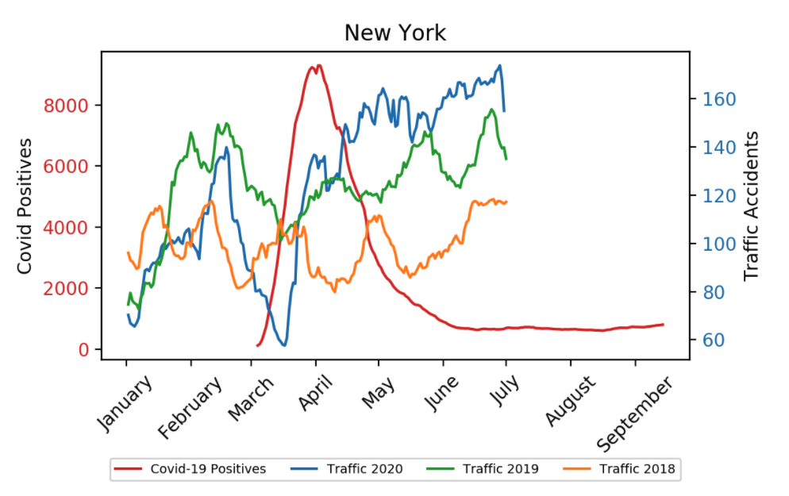
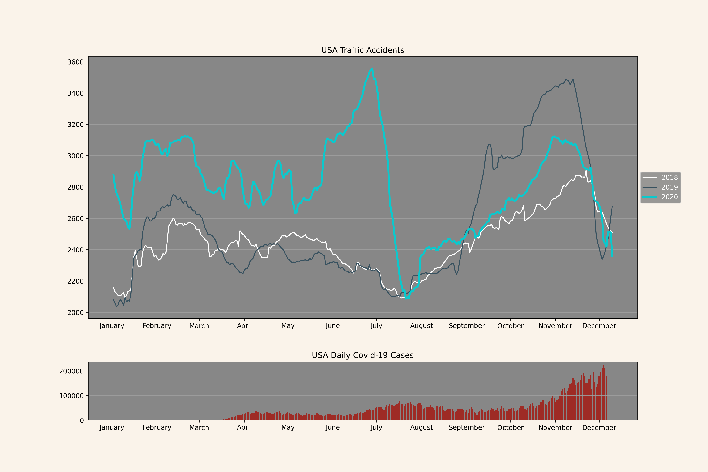
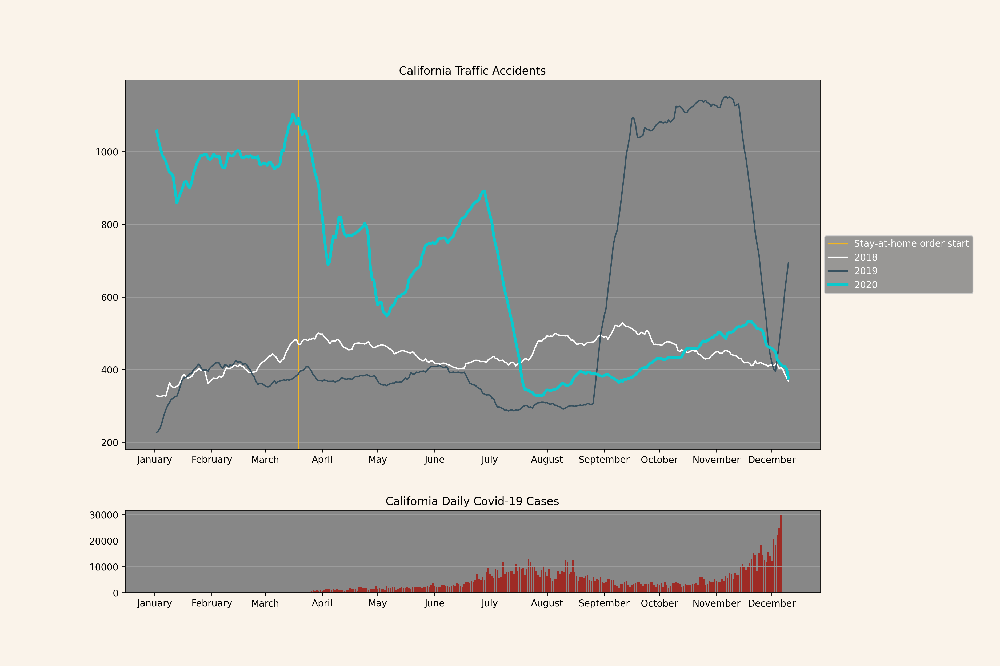
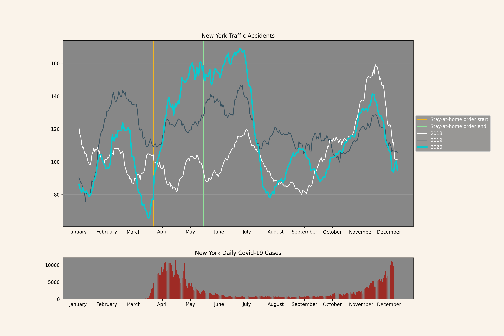
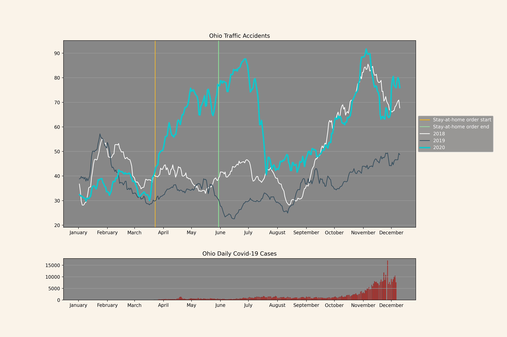
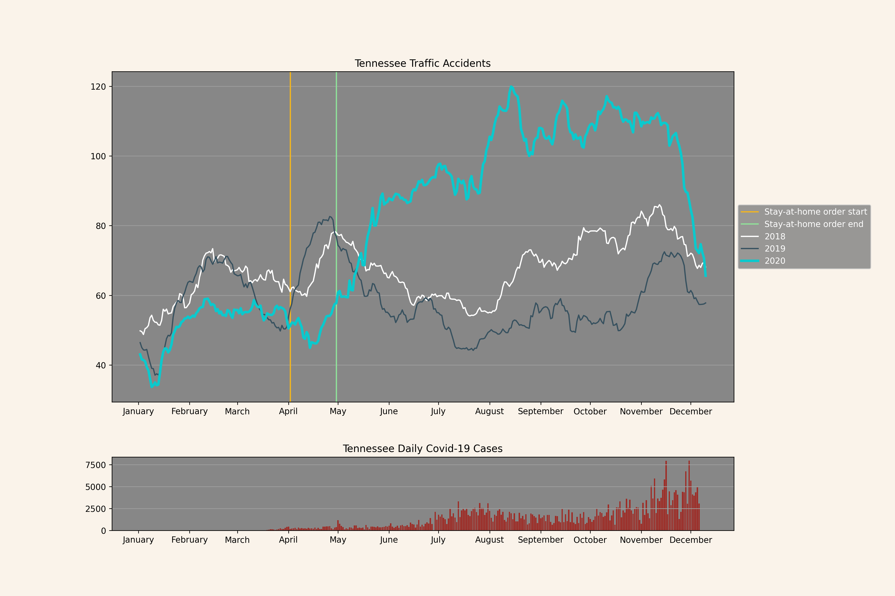
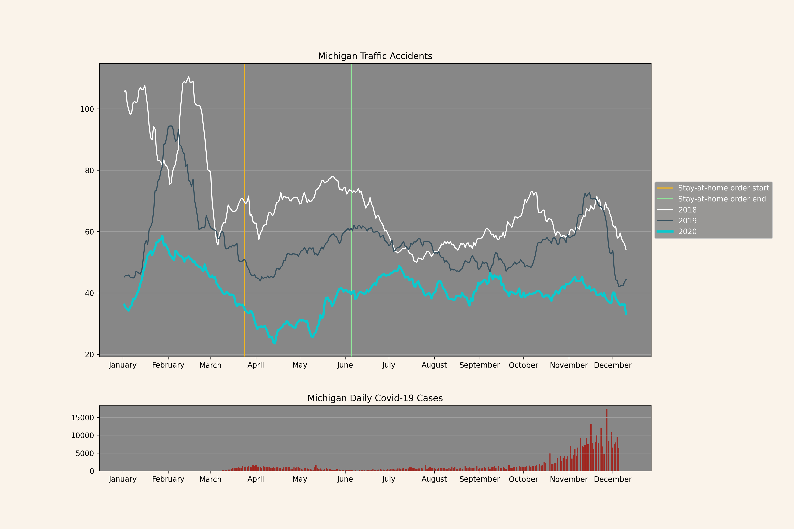

```{r setup, include=FALSE}
knitr::opts_chunk$set(echo = FALSE, warning = FALSE)
library(reticulate)
use_python("/usr/local/bin/python3", required = T)
```


```{css, echo=FALSE}


body {
  background-color: rgb(250, 243, 234);
  font-family: Arial, Helvetica, sans-serif;
  font-size: 14px;
  color: rgb(40, 40, 40);
}

.header {
  margin-top: 50px;
}

.title {
  color: black;
  marging-bottom: 10px;
}

```


<div class="header">
  <h3>Has the COVID-19 pandemic affected the number of traffic accidents in USA?</h3>
  <hr style="border-top: 1px solid rgb(180, 180, 180);" />
  <p style="text-align: right;">
  Lars Kristiansen, Eirik Pettersen and Marius Jørgensen
  <br />
  17/12/2020
  </p>
</div>


```{python, engine.path = '/usr/local/bin/python3', echo=FALSE, message=FALSE, results='hide', warning=FALSE}


```

<div style="height: 10px;"></div>
<h4 class="title">Overview and Motivation</h4>
<p>
With Covid-19 still spreading worldwide, we were interested in looking at traffic data to see if the pandemic had made an impact on the amount of traffic accidents occurring each day. As people are recommended to stay at home and travel less, we suspect that there will be less vehicles on the road which would reduce the chance of accidents.  To narrow down the scope of the project, we decided to focus on the United States, as it is the country with the most confirmed corona cases. The aim of the project is to uncover if there exists a correlation between Covid-19 and traffic accidents in the US.
</p>

<div style="height: 20px;"></div>
<h4 class="title">Related Work</h4>
<p>
No particular work inspired us to choose this topic, we were simply curious if there was a correlation. It seemed likely to us that corona would affect the number of vehicles on the road, which in turn would affect the probability of traffic accidents occurring. While traffic accidents are random events, having more people driving means that there are more opportunities for this random event to occur.
</p>


<div style="height: 20px;"></div>
<h4 class="title">Initial Questions</h4>
<p>
The initial question we wanted to answer was if there was a correlation between the spread of Covid-19 in the US and the number of traffic accidents. As the project progressed, we decided to look at Covid-19 positives and traffic accidents in each US state to give us additional data to compare states. We wanted to see if there were different outcomes in individual states, and compare each state to the whole country. We also decided to look at when each state issued a stay-at-home order to examine if this had an effect on traffic accidents.
</p>


<div style="height: 20px;"></div>
<h4 class="title">Data</h4>
<p>
Relevant data for the problem at hand was found on Kaggle. Both a dataset for traffic accidents, and a dataset for covid stats from there has been used. The traffic dataset contains data spanning from 2016 until June 2020. The dataset for Covid-19 contains data from the start of the pandemic in the USA, until the start of December 2020. When doing analysis of the data, we saw that without data for the second half of 2020, it could be hard to draw any conclusion whether traffic has made an impact or not. Therefore, we contacted the creator to ask if he could provide an updated dataset for the traffic. Something he could. The updated set contained two datasets from different sources (Bing and Mapquest) with accidents from June 2020 until December 2020, so we had to combine those two. The estimated amount of duplicates by combining those two sets is estimated to be less than 1% according to the creator of the dataset. Therefore, we decided to not do any pre processing to remove those possible duplicates.
</p>


<div style="height: 20px;"></div>
<h4 class="title">Exploratory Analysis</h4>
<p>
We started out by visualizing traffic and covid data as a line graph with a double y-axis. One y-axis for the number of traffic accidents each day, and the second y-axis for the number of confirmed covid-19 positive cases. For traffic accidents, we plotted the data for years 2018 to 2020 to see if there was a difference in the years prior to the outbreak. The traffic data was highly volatile, so a 21-day moving average was used to smooth out the values for each day. The volatility is caused by the fact that weekdays, weekends and holidays have different impacts on the number of vehicles on the road, and the fact that traffic accidents are randomly occurring events. We experimented with various window sizes, but the highly volatile data required a large moving average to compensate. Using a 21 day moving average revealed any steady increases or decreases in the data and kept the lines smoother. The double y-axis was removed and the traffic and covid data was split into separate subplots, since the double y-axis proved to be confusing to read. The traffic subplot displays traffic for 2018, 2019 and 2020 as 3 lines on a graph, with days on the x-axis and number of accidents each day on the y-axis. The covid-19 subplot is a barplot which displays new covid positives each day on the y-axis and days on the x-axis as a bar plot. The two subplots share the x-axis, so the covid data can be visually compared with the traffic data. As a final addition, the stay-at-home data was used to mark the timeframe where the stay-at-home order began and ended for each state.
</p>

<div style="height: 20px;"></div>
<center>
{width=50%}
</center>
<p style="text-align: center; margin-top: 10px;"><strong>Figure 1:</strong> A plot of New York with the original double y-axis design.</p>


<div style="height: 20px;"></div>
<h4 class="title">Final Analysis</h4>
<p>

</p>

<div style="height: 500px;"></div>


<h3>USA</h3>



<h3>California</h3>



<h3>Texas</h3>


<h3>Florida</h3>


<h3>Illinois</h3>


<h3>New York</h3>



<h3>Ohio</h3>


<h3>Pennsylvania</h3>


<h3>Tennessee</h3>


<h3>Michigan</h3>



<h3>Georgia</h3>

