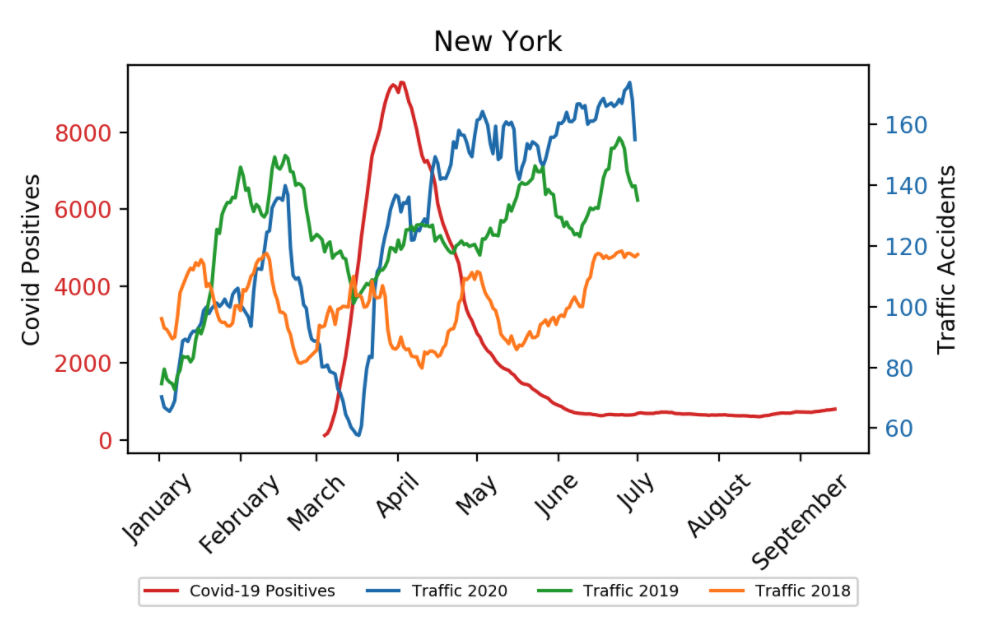
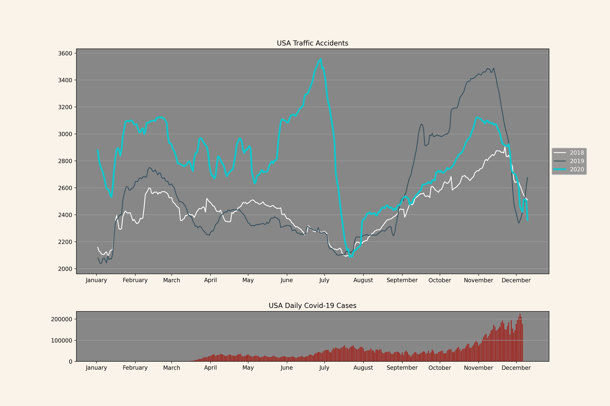
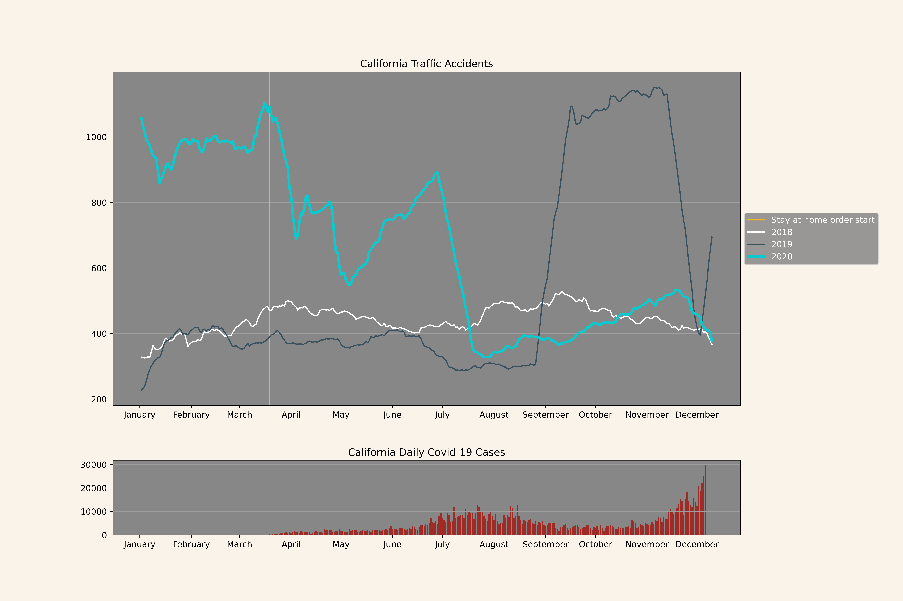
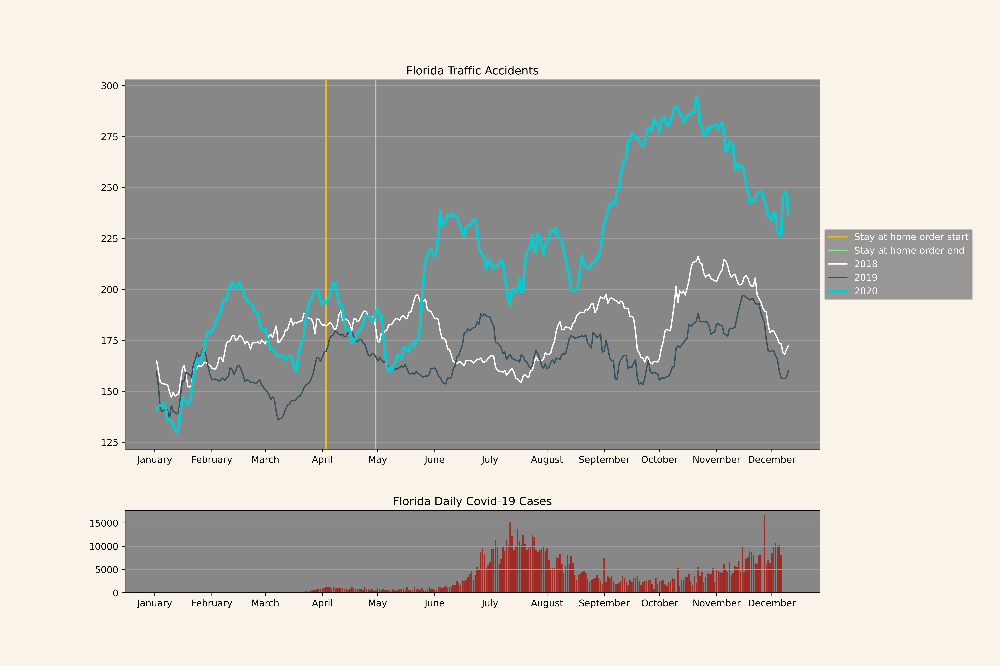
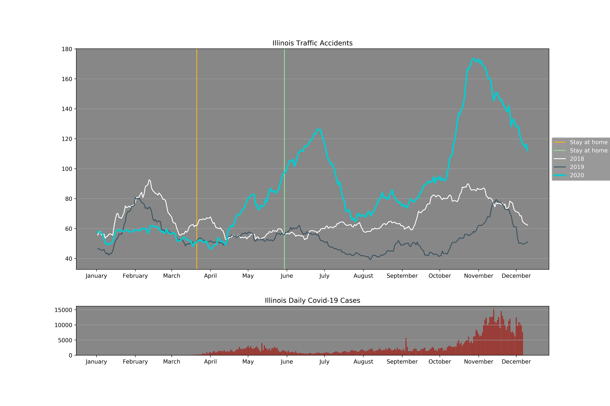
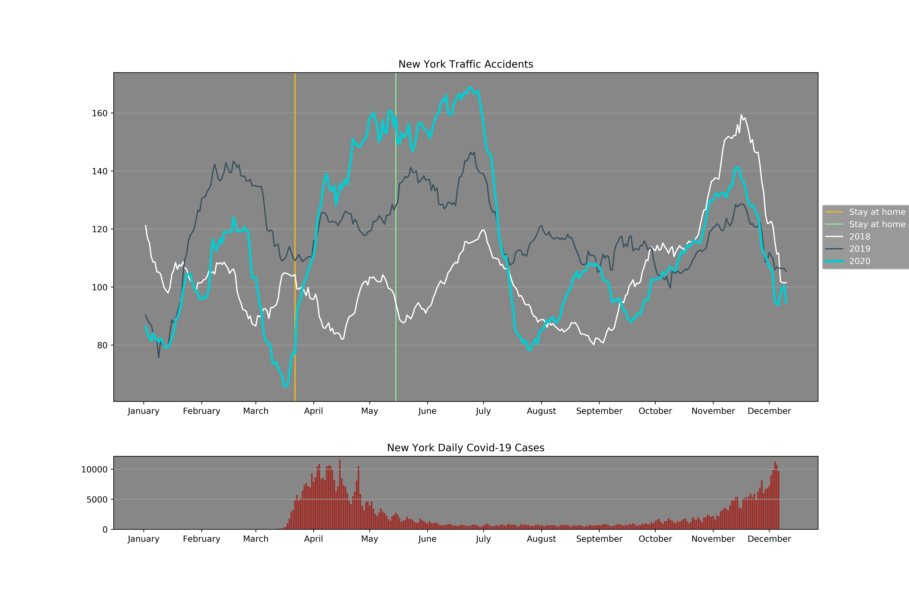
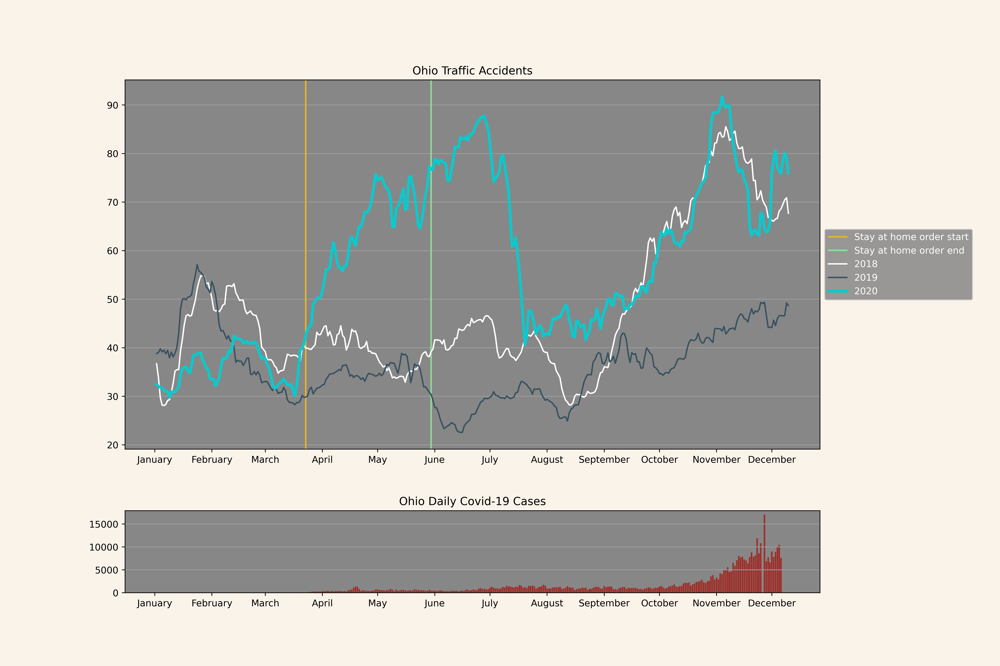
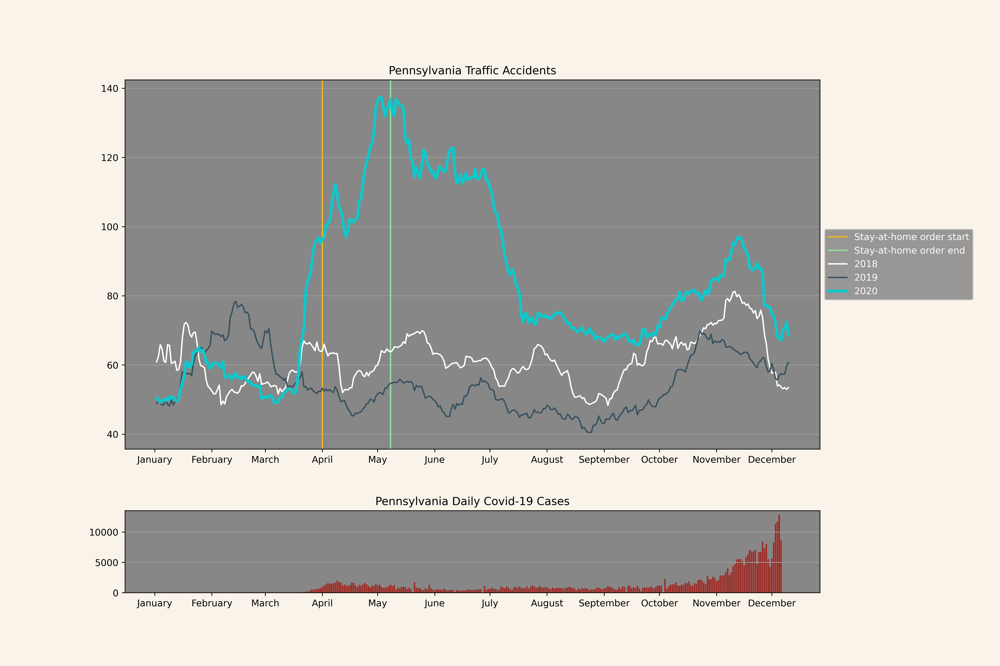
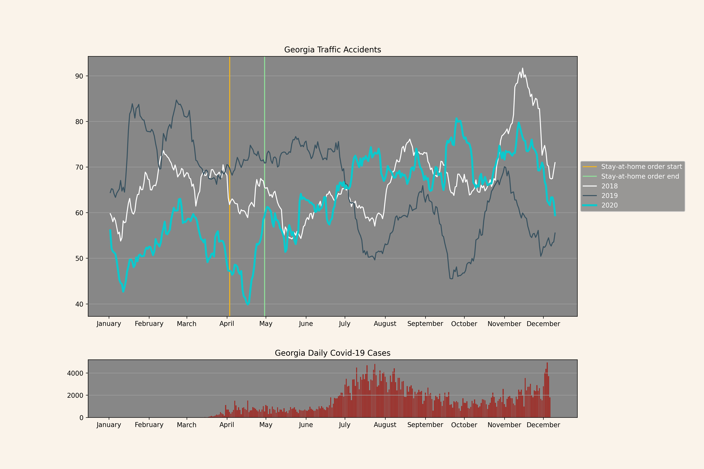

```{r setup, include=FALSE}
knitr::opts_chunk$set(echo = FALSE, warning = FALSE)
library(reticulate)
use_python("/usr/local/bin/python3", required = T)
```


```{css, echo=FALSE}


body {
  background-color: rgb(250, 243, 234);
  font-family: Arial, Helvetica, sans-serif;
  font-size: 14px;
  color: rgb(40, 40, 40);
}

.header {
  margin-top: 50px;
}

.title {
  color: black;
  marging-bottom: 10px;
}

```


<div class="header">
  <h3>Has Covid-19 affected traffic accidents in the USA?</h3>
  <hr style="border-top: 1px solid rgb(180, 180, 180);" />
  <p style="text-align: right;">
  Lars Kristiansen, Eirik Pettersen and Marius Jørgensen
  <br />
  17/12/2020
  </p>
</div>

<h4 class="title">How to run the project</h4>

* Zip file with all datasets used in this analysis:
    * https://drive.google.com/file/d/1DUXNfFXR6I1tOX8W6J1_vE_9P7UiC6LC/view?usp=sharing
    * Step 1: Unzip the file.
    * Step 2: Clone the github project at the URL: https://github.com/nesattorney/BED2056-project
    * Step 3: Place the unzipped data folder inside github project root folder
    * Step 4: Make sure you have the following python packages installed:
        * matplotlib
        * pandas
        * numpy
    * Step 5: Run the python script <code>plot_data.py</code> to generate the the figures.
        * <code>$ python3 plot_data.py</code>
    * Step 6: The plot for every state should appear in the <code>/figures</code> folder.
* The file <code>src/project.rmd</code> contains the details in our steps when developing the solution.
* The file <code>src/index.rmd</code> contains the contents for the public project website.
    * Visit the public website at the url: https://nesattorney.github.io/BED2056-project/ .

<h4 class="title">Sources</h4>

* Kaggle
    * Covid-19 data:
        * https://www.kaggle.com/sudalairajkumar/Covid19-in-usa
        * Kaggle, COVID-19 in USA, last read 17/12/2020
    * US accidents:
        * https://www.kaggle.com/sobhanmoosavi/us-accidents
        * Kaggle, US Accidents, last read 17/12/2020
* Stay-at-home order
    * https://eu.usatoday.com/storytelling/coronavirus-reopening-america-map/
        * USA Today, COVID-19 restrictions, last read 17/12/2020
    * https://en.wikipedia.org/wiki/U.S._state_and_local_government_responses_to_the_COVID-19_pandemic
        * Wikipedia, U.S. state and local government responses to the COVID-19 pandemic , last read 17/12/2020

    

<div style="height: 10px;"></div>
<h4 class="title">Overview and Motivation</h4>
<p>
With Covid-19 still spreading worldwide, we were interested in looking at traffic data to see if the pandemic had made an impact on the amount of traffic accidents occurring each day. As people are recommended to stay at home and travel less, we suspect that there will be less vehicles on the road which would reduce the chance of accidents.  To narrow down the scope of the project, we decided to focus on the United States, as it is the country with the most confirmed corona cases. The aim of the project is to uncover if there exists a correlation between Covid-19 and traffic accidents in the US.
</p>

<div style="height: 20px;"></div>
<h4 class="title">Related Work</h4>
<p>
No particular work inspired us to choose this topic, we were simply curious if there was a correlation. It seemed likely to us that corona would affect the number of vehicles on the road, which in turn would affect the probability of traffic accidents occurring. While traffic accidents are random events, having more people driving means that there are more opportunities for this random event to occur.
</p>


<div style="height: 20px;"></div>
<h4 class="title">Initial Questions</h4>
<p>
The initial question we wanted to answer was if there was a correlation between the spread of Covid-19 in the US and the number of traffic accidents. As the project progressed, we decided to look at Covid-19 positives and traffic accidents in each US state to give us additional data to compare states. We wanted to see if there were different outcomes in individual states, and compare each state to the whole country. We also decided to look at when each state issued a stay-at-home order to examine if this had an effect on traffic accidents.
</p>


<div style="height: 20px;"></div>
<h4 class="title">Data</h4>
<p>
Both the dataset for traffic accidents, and the dataset for covid were found on Kaggle. The traffic dataset contains data spanning from 2016 until June 2020, with various information about each accident, such as date, time, severity, source, longitude/latitude and state.  Each row in the dataset represents one accident. From the traffic dataset we only used information about which state in the USA the accident occured in, and date for the accident. Additional information such as accident severity has not been used. State names were represented by their 2-letter initials, so we decided to convert them into their full names. To get the number of accidents in the state, we simply count each row that has the matching state and date we are interested in.
</p>
<p>
The dataset for Covid-19 contains data from the start of the pandemic in the USA, until the start of December 2020. Like with the traffic dataset, the Covid dataset contains information that is not relevant for our use. The Covid data contained positive test results in a cumulative count, which we decided to convert into daily cases. Which state the Covid numbers come from, and the date is the most relevant for our case.
</p>
<p>
 The traffic dataset only contained data up to june 2020, which limited the potential of our analysis. It would be difficult to make any decisive conclusions on if traffic was impacted by covid or not. We contacted the creator to ask if he could provide us with an updated dataset for 2020, and he was able to send it to us. The updated set contained two datasets from different sources (Bing and Mapquest) with accidents from June 2020 until December 2020, so we had to combine the two of them. The estimated amount of duplicates by combining the two sets is estimated to be less than 1% according to the creator of the dataset. Therefore, we decided not to do any pre-processing to remove those possible duplicates. 
</p>
<p>
We found that lockdowns and covid related restrictions could be relevant. So we manually gathered information on when and if a state issued a stay-at-home order (Only leave home if necessary), and when and if the order has ended. Two sources were used for this. (https://eu.usatoday.com/storytelling/coronavirus-reopening-america-map/ and https://en.wikipedia.org/wiki/U.S._state_and_local_government_responses_to_the_COVID-19_pandemic). For all datasets, we formatted dates to be in the same format, and state names have been set equal.
</p>

<div style="height: 20px;"></div>
<h4 class="title">Exploratory Analysis</h4>
<p>
We started out by visualizing traffic and covid data as a line graph with a double y-axis. One y-axis for the number of traffic accidents each day, and the second y-axis for the number of confirmed covid-19 positive cases. For traffic accidents, we plotted the data for years 2018 to 2020 to see if there was a difference in the years prior to the outbreak. The traffic data was highly volatile, so a 21-day moving average was used to smooth out the values for each day. The volatility is caused by the fact that weekdays, weekends and holidays have different impacts on the number of vehicles on the road, and the fact that traffic accidents are randomly occurring events. We experimented with various window sizes, but the highly volatile data required a large moving average to compensate. Using a 21 day moving average revealed any steady increases or decreases in the data and kept the lines smoother. The double y-axis was removed and the traffic and covid data was split into separate subplots, since the double y-axis proved to be confusing to read (see figure 1). The traffic subplot displays traffic for 2018, 2019 and 2020 as 3 lines on a graph, with days on the x-axis and number of accidents each day on the y-axis. The covid-19 subplot is a barplot which displays new covid positives each day on the y-axis and days on the x-axis as a bar plot. The two subplots share the x-axis, so the covid data can be visually compared with the traffic data. As a final addition, the stay-at-home data was used to mark the timeframe where the stay-at-home order began and ended for each state.
</p>

<div style="height: 20px;"></div>
<center>
{width=50%}
</center>
<p style="text-align: center; margin-top: 10px;"><strong>Figure 1:</strong> A plot of New York with the original double y-axis design.</p>


<div style="height: 20px;"></div>
<h4 class="title">Final Analysis</h4>

<h5 class="title">USA</h5>
<p>
Traffic accidents start out noticeably higher than previous years even before Covid-19 reaches the country. Previous years started with around 2200 accidents a day, while the year 2020 had around 2900 accidents a day. The numbers stay stable until the middle of May this year, where accidents start to rise while previous years slowly descend. The first Covid-19 positive case was registered in the middle of March, but at this time there does not seem to be any noticeable change in traffic for 2020. Traffic starts dropping from almost 3600 a day to 2100 a day around the middle of July, where infections reach a new record peak in the US. As corona starts to slightly slow down its infection rate in august/september, the traffic accident rate for 2020 starts to steadily increase. However, this pattern from august to december in 2020 seems to match the pattern from previous years. Corona reaches an all-time peak in december, but the traffic accident rate still matches previous years around this time.
</p>



<h5 class="title">California</h5>
<p>
Accidents in 2020 start out almost 3 times higher than previous years in the month of January. California issues a stay-at-home order in the middle of March, which is immediately followed by daily traffic accidents reducing from over 1000 occurrences daily to about 700 cases in early april. Covid-19 infection rate reaches a new peak around the middle of July, where traffic starts dropping from 900 to 350 accidents a day. From September to December the accident rate in 2020 and 2018 seems to be similar, with 2019 being the outlier.
</p>



<h5 class="title">Texas</h5>
<p>
Rate of traffic accidents in 2020 reached the lowest it has ever been in the last 3 years during the stay-at-home order which lasted through April. Accidents were generally lower than the previous years until July where the patterns from each year starts to match. The traffic in 2020 does start to decrease below previous years in December, when Covid is on the rise.
</p>


<h5 class="title">Florida</h5>
<p>
Traffic for all 3 years behaved in a similar pattern, with a slight reduction in accident rate for 2020 during the stay-at-home order which lasted from April to May. In June, accident numbers started to rise, while Covid-19 positives also began to rise. Covid-19 reached a peak of 15000 daily cases in the middle of July, and traffic accident occurrences are noticeably higher than previous years. In September, the accidents for 2020 starts to increase while 2018 and 2019 stays stable. Florida traffic in 2020 started out with a similar pattern as previous years, but after June begins, the accidents starts to noticeably become higher than 2018 and 2019.
</p>


<h5 class="title">Illinois</h5>
<p>
During the stay-at-home order which lasted from mid March to June, traffic accidents for 2020 in Illinois seems to be increasing. In the middle of June, Covid-19 infection rate begins to slow down, but 2020 traffic keeps increasing until the beginning of July, making it twice as high compared to 2018 and 2019. The accident numbers begin to stabilize around August, but starts to increase again until it reaches a new peak around November. Covid-19 reaches a new peak in mid November, and traffic accidents around this time are about 2 times higher than previous years.
</p>



<h5 class="title">New York</h5>
<p>
The accident rate for 2020 starts out normal, but begins to increase around the stay-at-home order which lasted from mid March to mid May. Covid-19 infection rate begins to sharply increase around this time, but starts to calm down around May. In mid July, traffic accidents decrease to numbers which closely resemble previous years. Covid numbers begin to increase again around November, but the pattern for traffic accidents behave in a similar fashion to previous years.
</p>



<h5 class="title">Ohio</h5>
<p>
In Ohio, the number of traffic accidents in 2020 starts off in the same range as the two previous years. When the stay at home order starts, there is a huge increase in daily traffic accidents which keeps increasing in the stay at home period. In the start of July, one month after the stay at home period ended, the number of daily traffic accidents drops down to the same rate as the previous two years.
</p>


<h5 class="title">Pennsylvania</h5>
<p>
In Pennsylvania, the number of traffic accidents ranges from around 50 to 70 daily reported accidents throughout 2018 and 2019. However, in 2020 when the first Covid positives are reported, there is a huge increase in traffic accidents compared to the two previous years. Even during the stay at home order, the number of daily reported traffic accidents keeps increasing. From May 2020 to the start of December 2020 the number of traffic accidents has slowly decreased to now being in the same range as in the two previously reported years.
</p>


<h5 class="title">Tennessee</h5>
<p>
In Tennessee, there is clear correlation between the number of traffic accidents in 2018 and 2019. In 2020 the number of traffic accidents starts lower than the two previous years and decreases again during the stay at home period. After the stay-at-home period is over, as the number of Covid positives increases, the number of traffic accidents increases beyond the two previous years.
</p>


<h5 class="title">Michigan</h5>
<p>
In Michigan, there seems to be some indication of a pattern for the number of traffic accidents throughout the last three years. The number of traffic accidents in 2020 started lower than the previous years before the first Covid positive is registered. The lowest number of traffic accidents the last three years is registered in the period of the stay-at-home order, which is an indication that there may be a correlation between the stay-at-home order period and the number of traffic accidents.
</p>


<h5 class="title">Georgia</h5>
<p>
By just looking at the traffic accidents in 2018, 2019 and 2020 there does not seem to be any clear correlation between the different years. All three years the daily traffic accidents ranges from around 50 to 80 daily reported traffic accidents. However, there seems to be a drop in traffic accidents in the stay at home order period having a couple of days in the middle of April with the lowest reported traffic accidents compared to the last two years.
</p>


<div style="height: 40px;"></div>

<h4 class="title">Conclusion</h4>
<p>
Looking at the graphs from the US and the 10 states with the highest Covid-19 positive count, it is difficult to draw any decisive conclusions on if there is a correlation. While the number of traffic accidents are generally higher in 2020 than previous years, the numbers were already high before corona began spreading across the country. During the stay-at-home order, some states such as New York had a sharp increase in traffic accidents, while Texas had a sharp decrease. The accident numbers from state to state seem to be very different, it is hard to point out a clear pattern in each state. This may be a result of individual states handling the outbreak differently, and states having different population densities and road layouts. A state where more people normally use collective transport might get an increase in traffic accidents during the stay-at-home order, since people may feel discouraged to travel collectively and instead use their own private vehicle. If less people use collective transport, more cars are expected to be on the road, thus leading to a potential increase in traffic accidents during a stay-at-home order.
</p>


<div style="height: 100px;"></div>